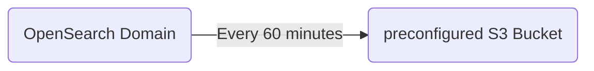
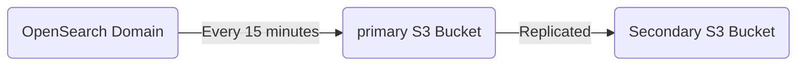

# Graylog Cloud Backup and Resore Policy

### Overview

**Backup and Recovery solution for Graylog Cloud. This policy is designed for the retention of all data involved in the Graylog Cloud service.This includes customer data, detail log retention, alerting, encryption, and data replication across sites. 

### General Requirements

We must guarantee backups and complete data restoration for the full period of time that a customer retains data with us. For example if a customer has contracted with us for 90 days of log retention, we must have a backup for the full 90 days and be able to restore all data upon request.

The requirements described are the default and may be overridden by more detailed requirements for specific components.

### Platform Component Specifics

#### AWS OpenSearch Service

Snapshots in Amazon OpenSearch Service are backups of a cluster's indexes and state.  These must be confifgured for every cluster. *State* includes cluster settings, node information, index settings, and shard allocation.

OpenSearch Service snapshots come in the following forms:

##### Automated Snapshots

Automated snapshots are only for cluster recovery. You can use them to restore your domain in the event of red cluster status or data loss. For more information, see [Restoring snapshots](https://docs.aws.amazon.com/opensearch-service/latest/developerguide/managedomains-snapshots.html#managedomains-snapshot-restore). 

OpenSearch Service stores hourly automated snapshots in a preconfigured Amazon S3 bucket at no additional charge, retaining up to 336 of them for 14 days. 

Hourly snapshots are less disruptive because of their incremental nature. They also provide a more recent recovery point in case of domain problems.

**<mark>NOTE:</mark>** If a cluster enters red status, all automated snapshots fail while that cluster status persists.

##### Manual Snapshots

Manual Snapshots are for cluster recovery or for moving data from one cluster to another.

As the name suggests, the creation of these snapshots must be initiated manually. These snapshots are stored in an assigned S3 bucket and standard S3 charges apply. 

Manual snapshots must be initiated every 15 minutes to provide a more recent recovery point than the automated snapshots and must be retained for 90 days.

To prevent against accidental backup deletion or in the event of an AWS region outage the S3 bucket must mirrored to a secondary bucket using S3 object replication.

